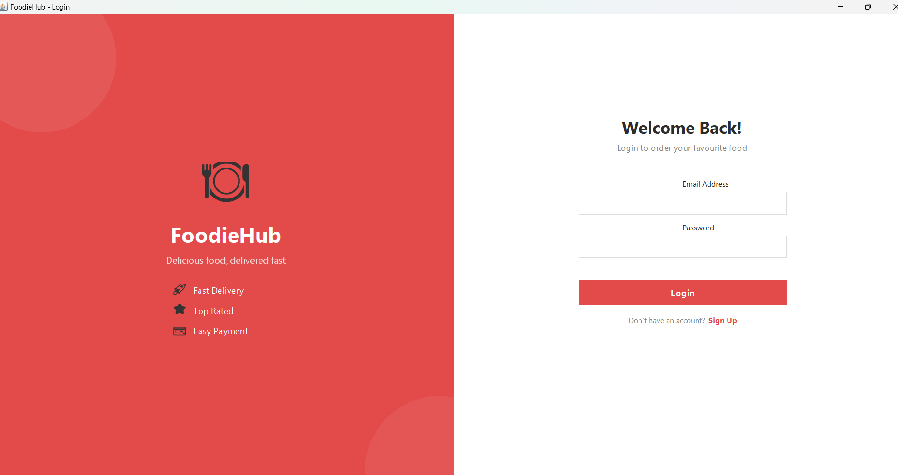
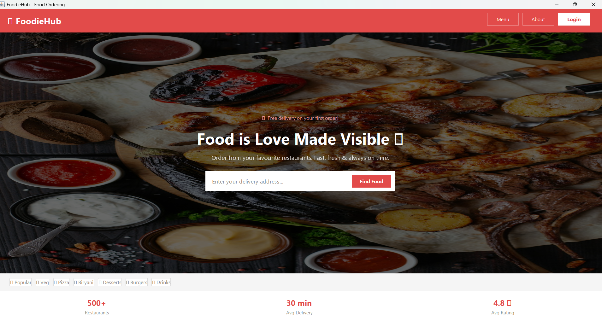
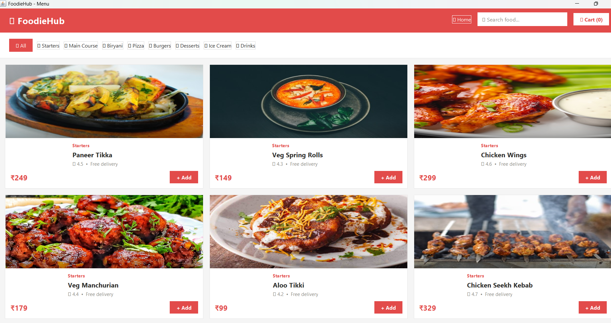
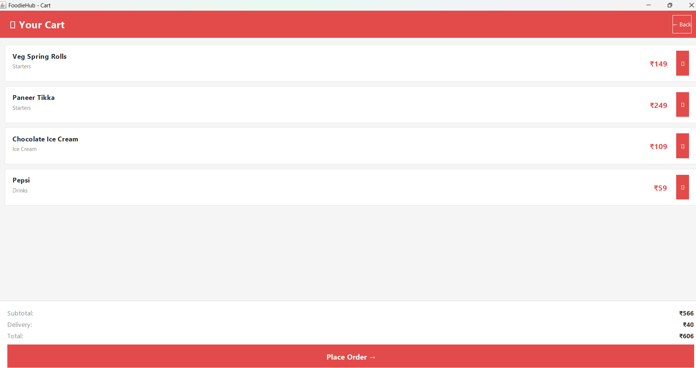
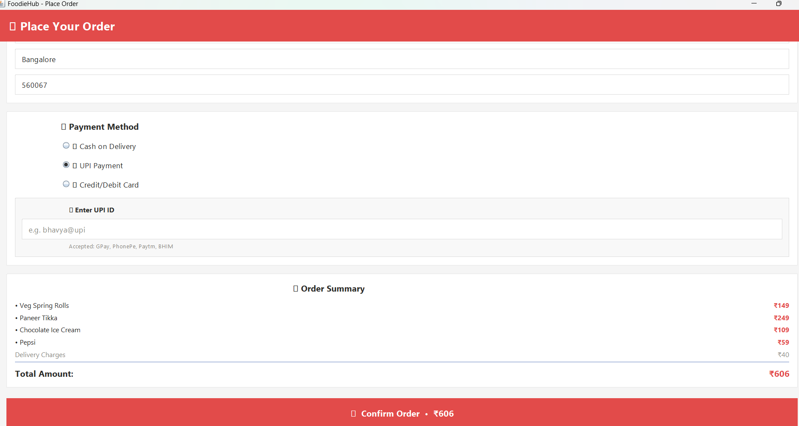
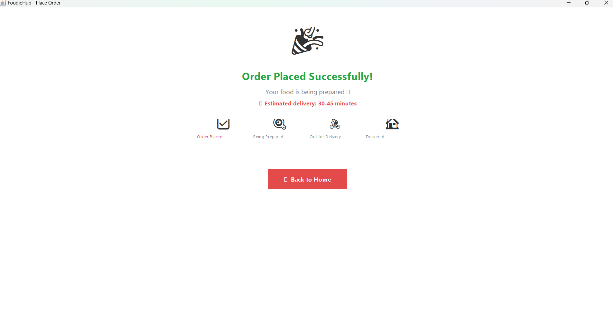
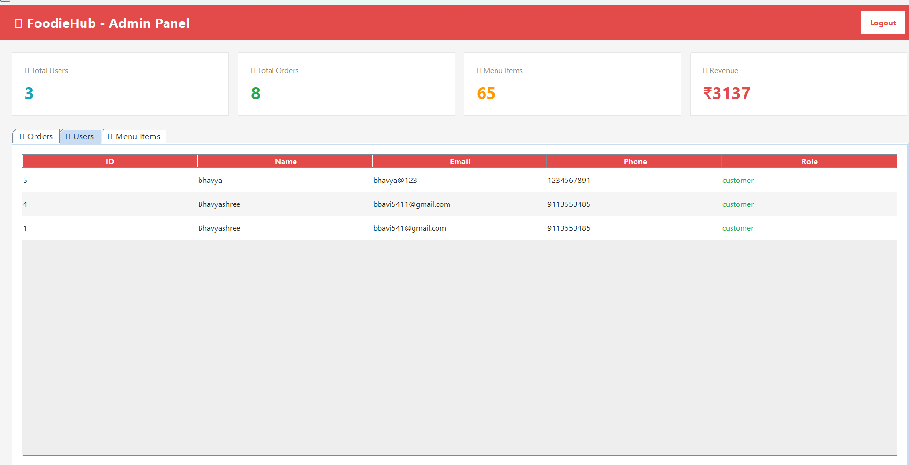

# FoodieHub - Food Delivery Application

## Overview

FoodieHub is a food delivery application developed using Java, JDBC, and MySQL. The system allows users to browse food items, add items to a cart, and place orders through a user-friendly interface.

## Features

* User Login System
* Food Menu Browsing
* Add to Cart Functionality
* Order Management
* Admin Dashboard
* Database Connectivity using JDBC

## Technologies Used

* Java
* JDBC
* MySQL
* VS Code

## Project Structure

* LoginPage.java - User authentication
* HomePage.java - Main application page
* MenuPage.java - Food menu display
* CartPage.java - Shopping cart management
* OrderPage.java - Order processing
* AdminDashboard.java - Admin controls
* DBConnection.java - Database connection
* User.java - User model

## Author

Bhavya Shree K S

## Project Type

Academic MCA Project
## Project Screenshots

### Login Page

### Home Page

### Menu Page

### Cart Page

### Order Page

### Order Placed Page

### Admin Dashboard

